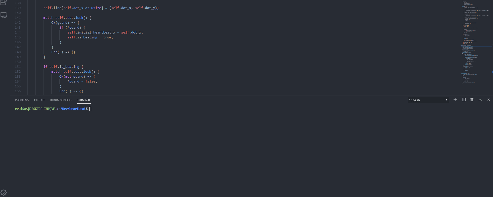

# heartbeat
A tiny terminal application which was born from a joke.
It helps to visualize whether an endpoing is responding by sending a http request and waiting for a response. If response is given, it beats, if not, *beeeeep*

